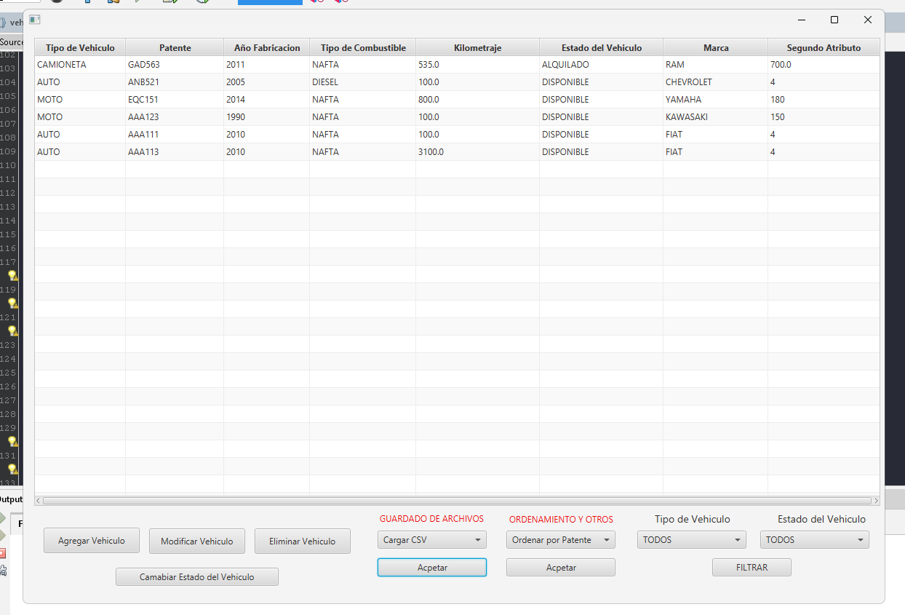
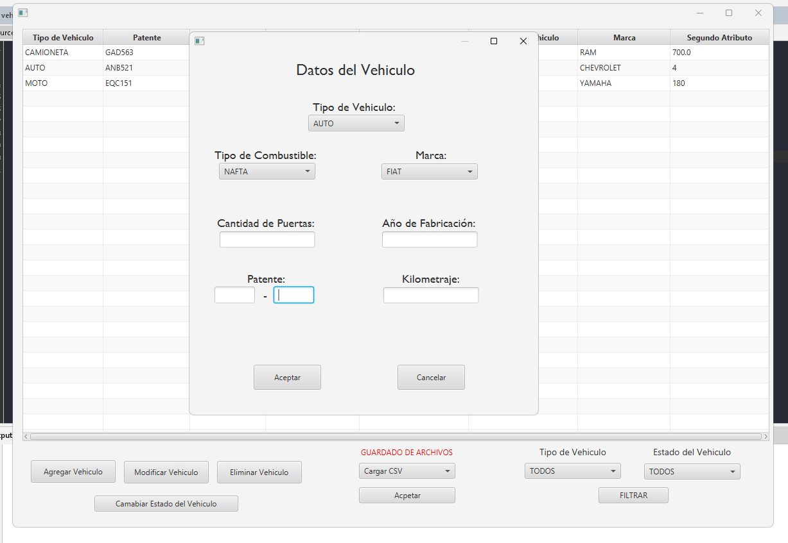
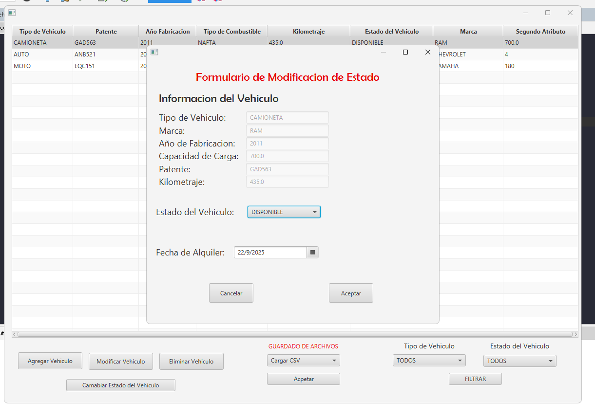
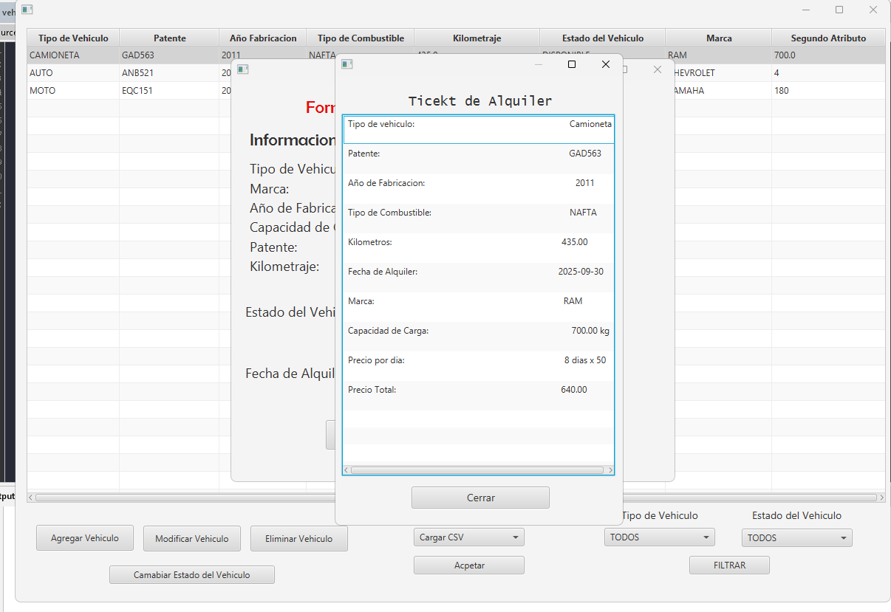
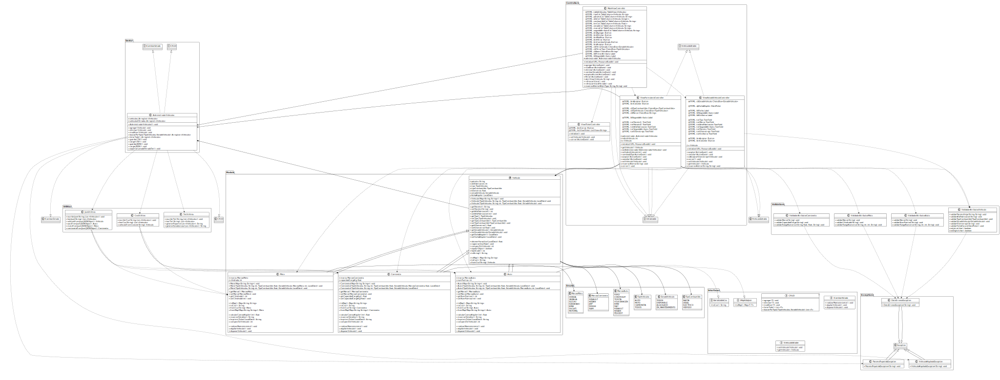
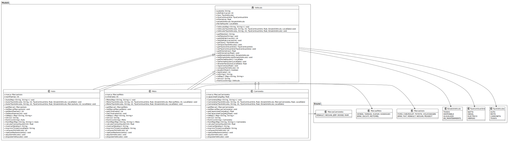
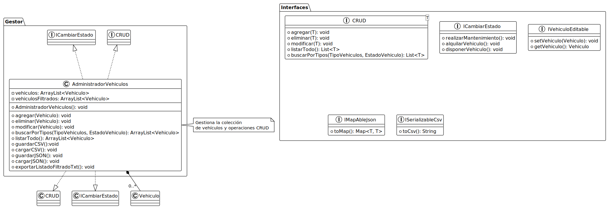
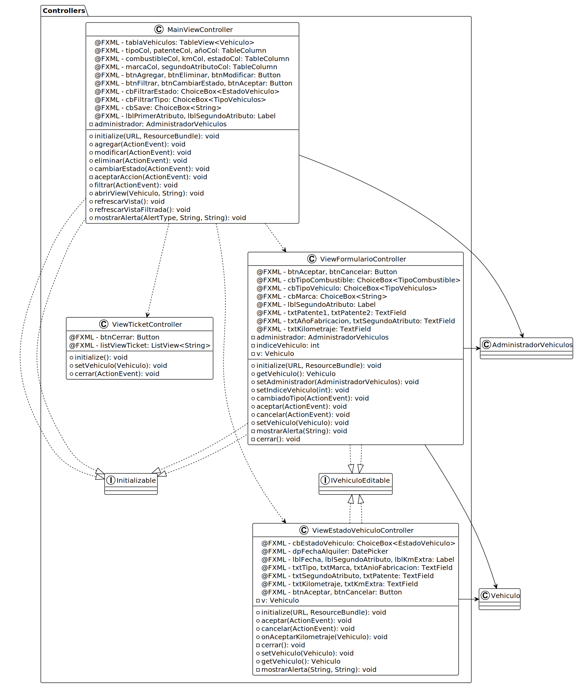
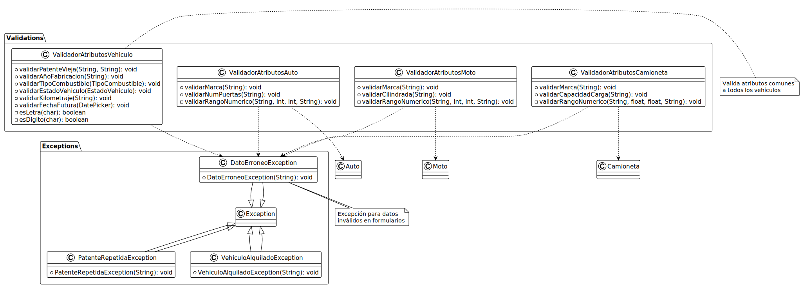
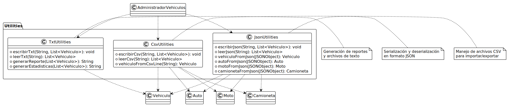

# 🚗 CRUD - Concesionaria de Vehículos

## 📋 Sobre mí

¡Hola! Soy **Santino Casado**, estudiante de la Tecnicatura en Programacion. Este proyecto representa mi examen final de Programacion II, donde he aplicado todos los conceptos aprendidos durante la cursado,
incluyendo programación orientada a objetos, interfaces gráficas con JavaFX, manejo de archivos y patrones de diseño.

## 📝 Resumen

**Concesionaria de Vehículos** es una aplicación de escritorio desarrollada en **Java con JavaFX** que permite gestionar un inventario completo de vehículos (Autos, Motos y Camionetas). Todavia esta en proceso ya que tengo varias ideas que me gustaria implementar, por lo que este proyecto se encontrara en constante cambio.

### 🎯 Funcionalidades principales:

- ✅ **CRUD completo**: Crear, leer, actualizar y eliminar vehículos
- ✅ **Gestión de estados**: Disponible, Alquilado, En Mantenimiento
- ✅ **Validaciones robustas**: Patentes únicas, datos correctos
- ✅ **Filtros avanzados**: Por tipo de vehículo y estado
- ✅ **Persistencia múltiple**: Guardado en CSV, JSON y TXT
- ✅ **Interfaz intuitiva**: Formularios dinámicos según tipo de vehículo

### 🖥️ Capturas de pantalla

#### Pantalla principal


_Vista principal con lista de vehículos y opciones de filtrado_

#### Formulario de creación/edición


_Formulario dinámico que cambia según el tipo de vehículo seleccionado_

#### Cambio de estado


_Interfaz para cambiar el estado de un vehículo_

#### Ticket de alquiler


_Generación de ticket al alquilar un vehículo_

### 🚀 Cómo usar la aplicación

1. **Agregar vehículo**: Clic en "Agregar" → Completar formulario → "Aceptar"
2. **Editar vehículo**: Seleccionar vehículo → Clic en "Modificar" → Editar datos → "Aceptar"
3. **Cambiar estado**: Seleccionar vehículo → Clic en "Cambiar Estado" → Elegir nuevo estado
4. **Filtrar**: Usar los ComboBox superiores para filtrar por tipo o estado
5. **Eliminar**: Seleccionar vehículo → Clic en "Eliminar" → Confirmar

## 🏗️ Diagrama de clases UML



#### 📦 Diagramas por Módulos:

| Módulo              | Diagrama                                          | Descripción                                     |
| ------------------- | ------------------------------------------------- | ----------------------------------------------- |
| **🏛️ Modelos**      |                  | Jerarquía de vehículos, enums y relaciones base |
| **⚙️ Interfaces**   |           | Contratos del sistema y gestor principal        |
| **🎮 Controllers**  |         | Controladores JavaFX y manejo de UI             |
| **✅ Validaciones** |  | Sistema de validación y excepciones             |
| **💾 Persistencia** |                    | Utilidades para JSON, CSV y TXT                 |

### 🔗 **Relaciones entre Módulos:**

- **Modelos** ← Implementan → **Interfaces**
- **Controllers** ← Utilizan → **Gestor** ← Contiene → **Modelos**
- **Controllers** ← Validan con → **Validaciones**
- **Gestor** ← Persiste con → **Utilities**

### Arquitectura del sistema:

- **Models**: Clases `Vehiculo` (abstracta), `Auto`, `Moto`, `Camioneta`
- **Controllers**: Controladores JavaFX para cada vista
- **Gestor**: `AdministradorVehiculos` implementa CRUD completo
- **Interfaces**: CRUD, IVehiculoEditable, IMapAbleJson, etc.
- **Validations**: Validadores específicos para cada tipo de vehículo
- **Utilities**: Clases para serialización (CSV, JSON, TXT)

## 📁 Archivos generados

### 📄 vehiculos.csv

```csv
CAMIONETA,GAD563,2011,NAFTA,435.00,DISPONIBLE,2025-09-22,RAM,700.0
AUTO,ANB521,2005,DIESEL,0.00,DISPONIBLE,2025-09-22,CHEVROLET,4
MOTO,EQC151,2014,NAFTA,700.00,DISPONIBLE,2025-09-22,YAMAHA,180
```

### 🔧 vehiculos.json

```json
[
  {
    "añoFabricacion": "2010",
    "marca": "FIAT",
    "tipo": "AUTO",
    "tipoCombustible": "NAFTA",
    "estadoVehiculo": "DISPONIBLE",
    "kilometros": "0.0",
    "numPuertas": "4",
    "patente": "AAA111",
    "fechaAlquiler": "2025-09-22"
  },
  {
    "añoFabricacion": "2010",
    "marca": "FIAT",
    "tipo": "AUTO",
    "tipoCombustible": "NAFTA",
    "estadoVehiculo": "DISPONIBLE",
    "kilometros": "3000.0",
    "numPuertas": "4",
    "patente": "AAA113",
    "fechaAlquiler": "2025-09-22"
  },
  {
    "añoFabricacion": "1990",
    "marca": "KAWASAKI",
    "tipo": "MOTO",
    "tipoCombustible": "NAFTA",
    "estadoVehiculo": "DISPONIBLE",
    "cilindrada": "150",
    "kilometros": "0.0",
    "patente": "AAA123",
    "fechaAlquiler": "2025-09-22"
  }
]
```

### 📝 vehiculos.txt

```
Listado de Vehículos
Patente	Tipo	Marca	Año	Estado	Km
AAA111	AUTO	FIAT	2010	DISPONIBLE	12312.00
Listado de Vehículos
Patente	Tipo	Marca	Año	Estado	Km
AAA111	MOTO	KAWASAKI	2010	DISPONIBLE	90.00
LISTADO COMPLETO DE VEHÍCULOS ACTUALIZADO
Patente	Tipo	Marca	Año	Estado	Km
AAA123	CAMIONETA	RAM	2010	DISPONIBLE	0.00
AAC111	MOTO	HONDA	2010	DISPONIBLE	0.00
AVC111	AUTO	FIAT	2010	DISPONIBLE	500.00
```

## 🛠️ Tecnologías utilizadas

- **Java 17+**
- **JavaFX** para la interfaz gráfica
- **JSON.org** para manejo de JSON
- **PlantUML** para diagramas UML

## 🔍 Características técnicas destacadas

- **Patrón CRUD**: Implementación completa con interfaz genérica
- **Validaciones robustas**: Sistema de validaciones por tipo de vehículo
- **Persistencia múltiple**: Guardado simultáneo en 3 formatos diferentes
- **Polimorfismo**: Uso extensivo de herencia y interfaces
- **Manejo de excepciones**: Excepciones personalizadas para casos específicos
- **Interfaz dinámica**: Formularios que cambian según el contexto

## 📞 Contacto

- **Estudiante**: Santino Casado
- **Materia**: Programación II
- **Año**: 2024
- **Email**: santinocasado05@gmail.com
- **LinkedIn**: Santino Casado

---

_Este proyecto fue desarrollado como parte del examen final de Programación II, demostrando el dominio de conceptos avanzados de programación orientada a objetos, interfaces gráficas y persistencia de datos._
